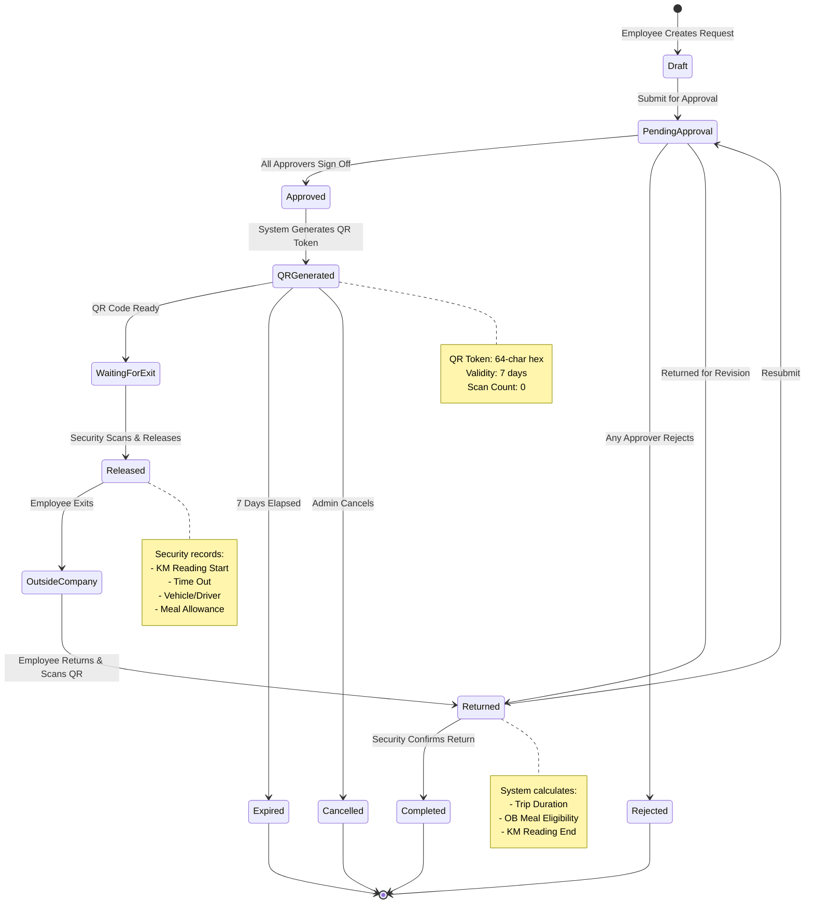
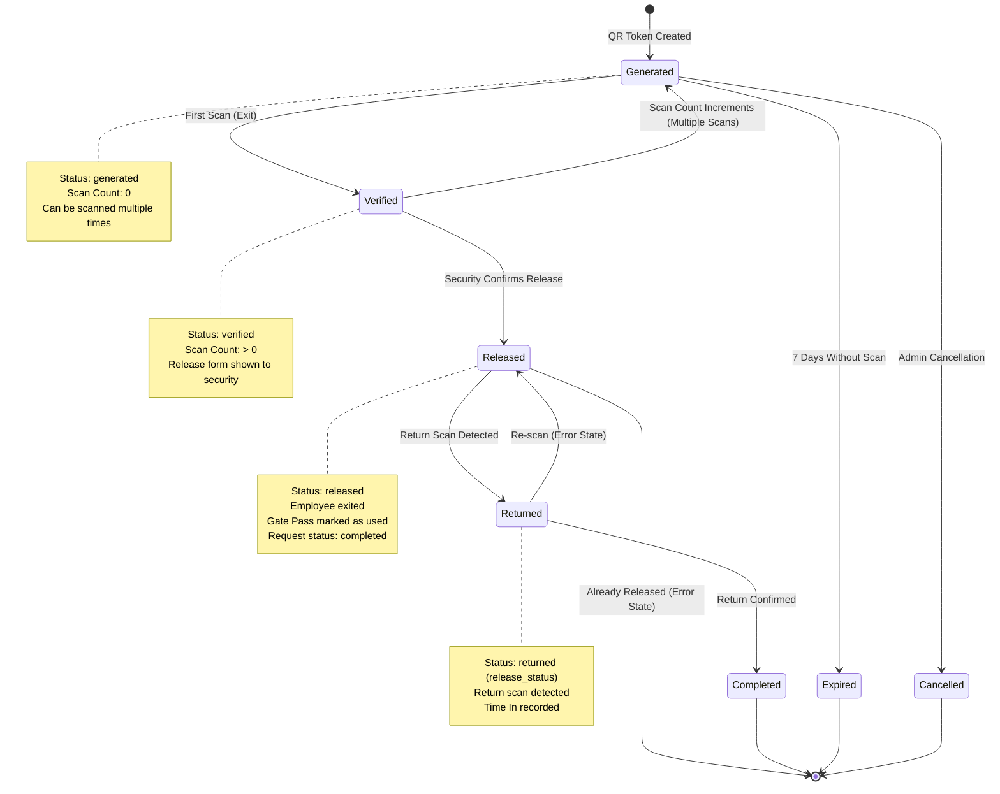
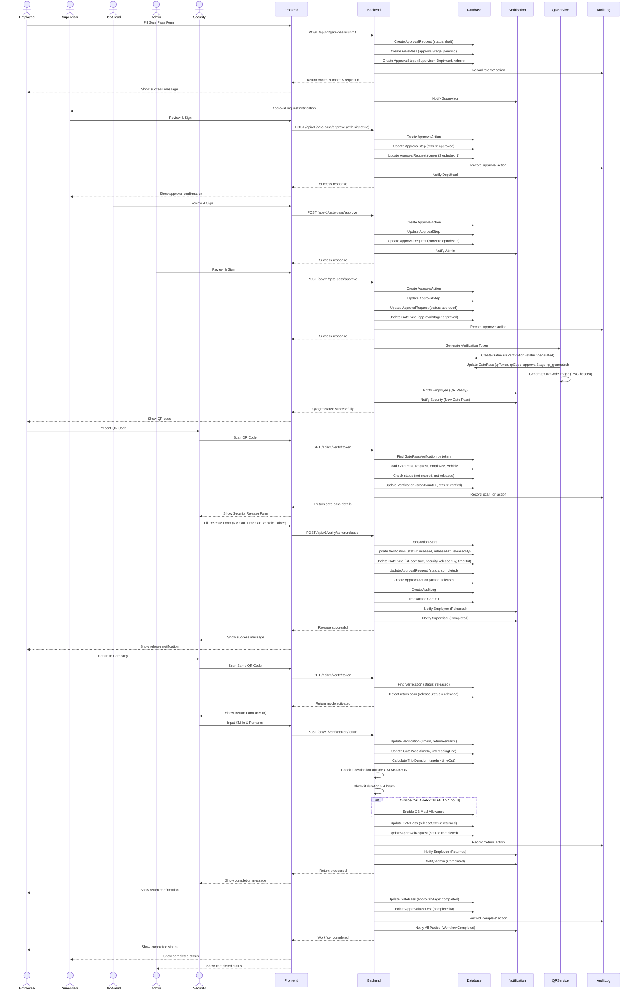
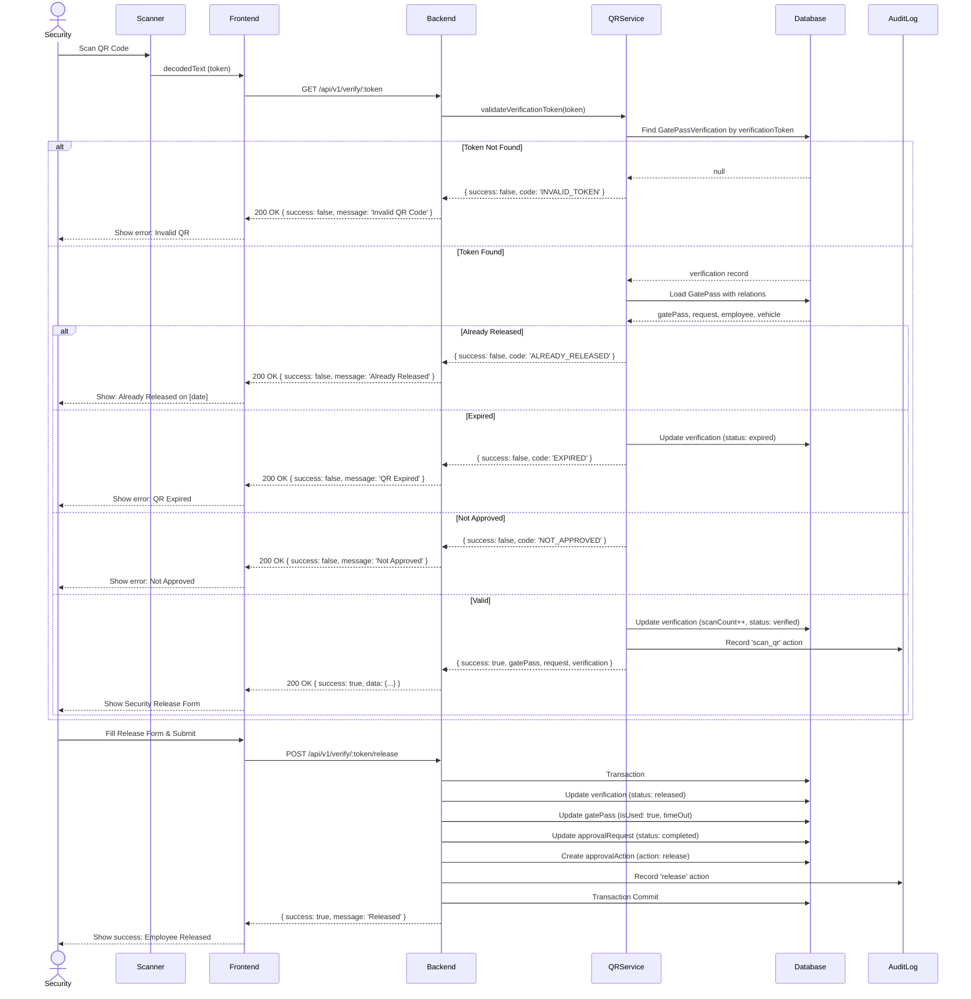
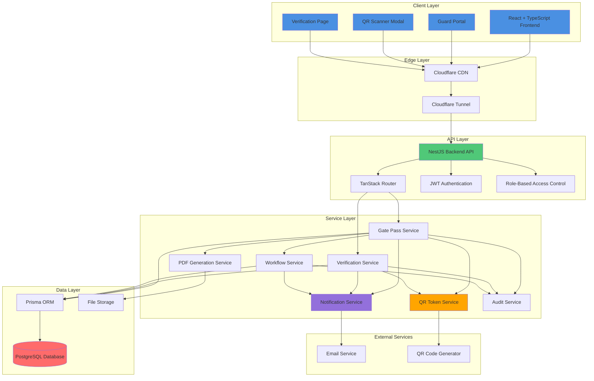
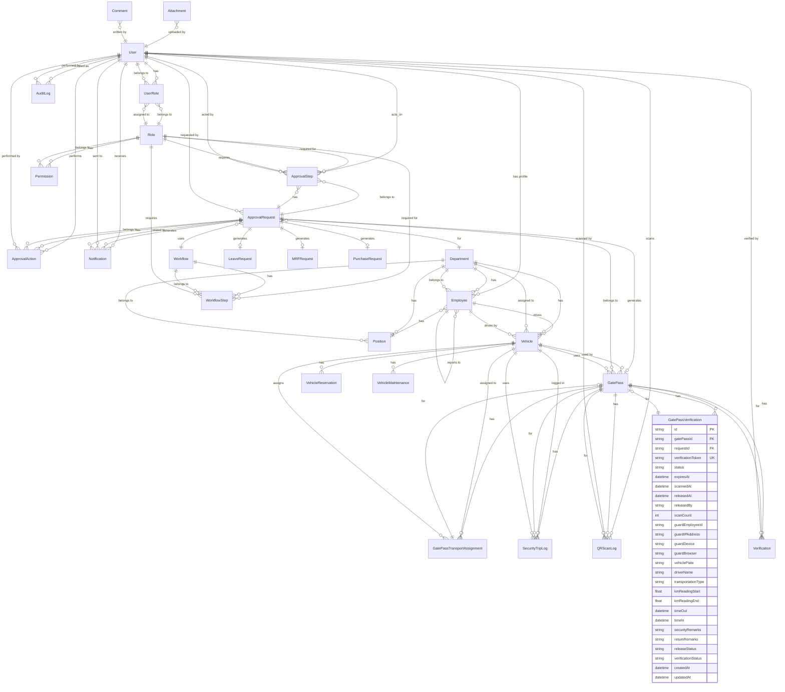

# HST Enterprise Request Portal
## Gate Pass Management System - Complete System Documentation

**Version:** 1.0  
**Date:** July 18, 2025  
**Prepared by:** Senior Enterprise Solution Architect  
**Classification:** Internal Use - ISO 9001 Compliant

---

## Table of Contents

1. [Executive Workflow](#1-executive-workflow)
2. [BPMN 2.0 Swimlane Diagram](#2-bpmn-20-swimlane-diagram)
3. [State Machine Diagram](#3-state-machine-diagram)
4. [Sequence Diagram](#4-sequence-diagram)
5. [System Architecture Diagram](#5-system-architecture-diagram)
6. [Entity Relationship Diagram](#6-entity-relationship-diagram)
7. [Security QR Verification Flow](#7-security-qr-verification-flow)
8. [Security Guard Process](#8-security-guard-process)
9. [Employee Return Process](#9-employee-return-process)
10. [Database Enhancement Report](#10-database-enhancement-report)

---

## 1. Executive Workflow

### 1.1 Overview

The HST Gate Pass Management System is a comprehensive enterprise solution for managing employee, vehicle, and asset movements through company gates. The system implements a digital workflow with QR code verification, multi-level approval, and real-time tracking.

### 1.2 High-Level Process Flow

```
┌─────────────────────────────────────────────────────────────────────────┐
│                         GATE PASS LIFECYCLE                              │
└─────────────────────────────────────────────────────────────────────────┘

  EMPLOYEE                    APPROVERS                  SECURITY
    │                            │                          │
    │  1. Create Request         │                          │
    │  ────────────────────────> │                          │
    │                            │                          │
    │                            │ 2. Review & Approve      │
    │                            │ ───────────────────────> │
    │                            │                          │
    │                            │ 3. QR Code Generated     │
    │                            │ <─────────────────────── │
    │                            │                          │
    │                            │ 4. Present QR at Gate    │
    │                            │ -----------------------> │
    │                            │                          │
    │                            │                          │ 5. Scan & Verify
    │                            │                          │ 6. Release Employee
    │                            │                          │
    │  7. Return to Company      │                          │
    │  <────────────────────────────────────────────────────── │
    │                            │                          │
    │                            │                          │ 8. Scan Return QR
    │                            │                          │ 9. Mark Completed
    │                            │                          │
    └──────────────────────────────────────────────────────────┘
```

### 1.3 Key Process Stages

| Stage | Description | Responsible Party | Duration |
|-------|-------------|-------------------|----------|
| **Draft** | Employee creates gate pass request | Employee | 5-10 min |
| **Pending Approval** | Request submitted for approval | System | 1-3 days |
| **Approved** | All approvers signed off | Approvers | - |
| **QR Generated** | Secure QR token created | System | Instant |
| **Waiting for Exit** | Employee at gate awaiting release | Security | Variable |
| **Released** | Employee exits company premises | Security Guard | Instant |
| **Outside Company** | Employee on official business | Employee | Variable |
| **Returned** | Employee returns and scans QR | Security Guard | Instant |
| **Completed** | Workflow fully closed | System | Instant |

### 1.4 Business Rules

1. **Approval Hierarchy**: All gate passes require sequential approval from:
   - Immediate Supervisor (Recommendation)
   - Department Head (Noted)
   - Admin/Manager (Approval)

2. **QR Code Validity**: 
   - Valid for 7 days from generation
   - Single-use for exit (status changes to "released")
   - Reusable for return (same QR token)

3. **Security Release Requirements**:
   - Mandatory: KM Reading (Start), Time Out, Transportation Type
   - Conditional: Vehicle Plate & Driver (if not "Commute")
   - Optional: Meal Allowance (if destination outside CALABARZON)

4. **Return Processing**:
   - Automatic Time In recording
   - Trip duration calculation
   - OB Meal allowance trigger (if > 4 hours outside CALABARZON)

---

## 2. BPMN 2.0 Swimlane Diagram

### 2.1 Complete Workflow with Swimlanes

```mermaid
bpmn
  <?xml version="1.0" encoding="UTF-8"?>
  <bpmn:definitions xmlns:xsi="http://www.w3.org/2001/XMLSchema-instance" xmlns:bpmn="http://www.omg.org/spec/BPMN/20100524/MODEL" xmlns:bpmndi="http://www.omg.org/spec/BPMN/20100524/DI" id="Definitions_1" targetNamespace="http://bpmn.io/schema/bpmn">
    <bpmn:process id="GatePassProcess" name="Gate Pass Management Process" isExecutable="false">
      <!-- Start Event -->
      <bpmn:startEvent id="StartEvent_1" name="Employee Creates Request">
        <bpmn:outgoing>Flow_1</bpmn:outgoing>
      </bpmn:startEvent>

      <!-- Employee Activities -->
      <bpmn:task id="Task_Employee_Create" name="Create Gate Pass Request" bpmn:lane="Employee">
        <bpmn:incoming>Flow_1</bpmn:incoming>
        <bpmn:outgoing>Flow_2</bpmn:outgoing>
      </bpmn:task>

      <bpmn:task id="Task_Employee_Submit" name="Submit for Approval" bpmn:lane="Employee">
        <bpmn:incoming>Flow_2</bpmn:incoming>
        <bpmn:outgoing>Flow_3</bpmn:outgoing>
      </bpmn:task>

      <bpmn:task id="Task_Employee_PresentQR" name="Present QR Code at Gate" bpmn:lane="Employee">
        <bpmn:incoming>Flow_15</bpmn:incoming>
        <bpmn:outgoing>Flow_16</bpmn:outgoing>
      </bpmn:task>

      <bpmn:task id="Task_Employee_Return" name="Return to Company & Scan QR" bpmn:lane="Employee">
        <bpmn:incoming>Flow_22</bpmn:incoming>
        <bpmn:outgoing>Flow_23</bpmn:outgoing>
      </bpmn:task>

      <!-- Approver Activities -->
      <bpmn:userTask id="Task_Supervisor_Review" name="Review & Recommend" bpmn:lane="Approvers">
        <bpmn:incoming>Flow_3</bpmn:incoming>
        <bpmn:outgoing>Flow_4</bpmn:outgoing>
      </bpmn:userTask>

      <bpmn:userTask id="Task_DeptHead_Review" name="Review & Note" bpmn:lane="Approvers">
        <bpmn:incoming>Flow_4</bpmn:incoming>
        <bpmn:outgoing>Flow_5</bpmn:outgoing>
      </bpmn:userTask>

      <bpmn:userTask id="Task_Admin_Review" name="Final Approval" bpmn:lane="Approvers">
        <bpmn:incoming>Flow_5</bpmn:incoming>
        <bpmn:outgoing>Flow_6</bpmn:outgoing>
      </bpmn:userTask>

      <!-- System Activities -->
      <bpmn:serviceTask id="Task_System_GenerateQR" name="Generate QR Token" bpmn:lane="System">
        <bpmn:incoming>Flow_6</bpmn:incoming>
        <bpmn:outgoing>Flow_7</bpmn:outgoing>
      </bpmn:serviceTask>

      <bpmn:serviceTask id="Task_System_ValidateQR" name="Validate QR Token" bpmn:lane="System">
        <bpmn:incoming>Flow_16</bpmn:incoming>
        <bpmn:outgoing>Flow_17</bpmn:outgoing>
      </bpmn:serviceTask>

      <bpmn:serviceTask id="Task_System_UpdateStatus" name="Update Gate Pass Status" bpmn:lane="System">
        <bpmn:incoming>Flow_20</bpmn:incoming>
        <bpmn:outgoing>Flow_21</bpmn:outgoing>
      </bpmn:serviceTask>

      <bpmn:serviceTask id="Task_System_CalculateDuration" name="Calculate Trip Duration" bpmn:lane="System">
        <bpmn:incoming>Flow_23</bpmn:incoming>
        <bpmn:outgoing>Flow_24</bpmn:outgoing>
      </bpmn:serviceTask>

      <bpmn:serviceTask id="Task_System_Complete" name="Mark as Completed" bpmn:lane="System">
        <bpmn:incoming>Flow_26</bpmn:incoming>
        <bpmn:outgoing>Flow_27</bpmn:outgoing>
      </bpmn:serviceTask>

      <!-- Database Activities -->
      <bpmn:serviceTask id="Task_DB_SaveRequest" name="Save Approval Request" bpmn:lane="Database">
        <bpmn:incoming>Flow_2</bpmn:incoming>
        <bpmn:outgoing>Flow_3</bpmn:outgoing>
      </bpmn:serviceTask>

      <bpmn:serviceTask id="Task_DB_SaveGatePass" name="Save Gate Pass Record" bpmn:lane="Database">
        <bpmn:incoming>Flow_7</bpmn:incoming>
        <bpmn:outgoing>Flow_8</bpmn:outgoing>
      </bpmn:serviceTask>

      <bpmn:serviceTask id="Task_DB_UpdateVerification" name="Update Verification Record" bpmn:lane="Database">
        <bpmn:incoming>Flow_17</bpmn:incoming>
        <bpmn:outgoing>Flow_18</bpmn:outgoing>
      </bpmn:serviceTask>

      <bpmn:serviceTask id="Task_DB_SaveRelease" name="Save Release Data" bpmn:lane="Database">
        <bpmn:incoming>Flow_20</bpmn:incoming>
        <bpmn:outgoing>Flow_21</bpmn:outgoing>
      </bpmn:serviceTask>

      <bpmn:serviceTask id="Task_DB_SaveReturn" name="Save Return Data" bpmn:lane="Database">
        <bpmn:incoming>Flow_25</bpmn:incoming>
        <bpmn:outgoing>Flow_26</bpmn:outgoing>
      </bpmn:serviceTask>

      <!-- Notification Service Activities -->
      <bpmn:serviceTask id="Task_Notify_Approval" name="Send Approval Notification" bpmn:lane="Notifications">
        <bpmn:incoming>Flow_8</bpmn:incoming>
        <bpmn:outgoing>Flow_9</bpmn:outgoing>
      </bpmn:serviceTask>

      <bpmn:serviceTask id="Task_Notify_QRReady" name="Notify QR Ready" bpmn:lane="Notifications">
        <bpmn:incoming>Flow_10</bpmn:incoming>
        <bpmn:outgoing>Flow_11</bpmn:outgoing>
      </bpmn:serviceTask>

      <bpmn:serviceTask id="Task_Notify_Released" name="Notify Employee Released" bpmn:lane="Notifications">
        <bpmn:incoming>Flow_21</bpmn:incoming>
        <bpmn:outgoing>Flow_22</bpmn:outgoing>
      </bpmn:serviceTask>

      <bpmn:serviceTask id="Task_Notify_Completed" name="Notify Workflow Completed" bpmn:lane="Notifications">
        <bpmn:incoming>Flow_27</bpmn:incoming>
        <bpmn:outgoing>Flow_28</bpmn:outgoing>
      </bpmn:serviceTask>

      <!-- QR Service Activities -->
      <bpmn:serviceTask id="Task_QR_Generate" name="Generate QR Code Image" bpmn:lane="QR Service">
        <bpmn:incoming>Flow_7</bpmn:incoming>
        <bpmn:outgoing>Flow_8</bpmn:outgoing>
      </bpmn:serviceTask>

      <bpmn:serviceTask id="Task_QR_Validate" name="Validate QR Token" bpmn:lane="QR Service">
        <bpmn:incoming>Flow_16</bpmn:incoming>
        <bpmn:outgoing>Flow_17</bpmn:outgoing>
      </bpmn:serviceTask>

      <!-- Security Guard Activities -->
      <bpmn:userTask id="Task_Security_ScanQR" name="Scan QR Code" bpmn:lane="Security Guard">
        <bpmn:incoming>Flow_12</bpmn:incoming>
        <bpmn:outgoing>Flow_13</bpmn:outgoing>
      </bpmn:userTask>

      <bpmn:userTask id="Task_Security_FillForm" name="Fill Security Release Form" bpmn:lane="Security Guard">
        <bpmn:incoming>Flow_13</bpmn:incoming>
        <bpmn:outgoing>Flow_14</bpmn:outgoing>
      </bpmn:userTask>

      <bpmn:userTask id="Task_Security_Release" name="Release Employee" bpmn:lane="Security Guard">
        <bpmn:incoming>Flow_14</bpmn:incoming>
        <bpmn:outgoing>Flow_15</bpmn:outgoing>
      </bpmn:userTask>

      <bpmn:userTask id="Task_Security_ScanReturn" name="Scan Return QR" bpmn:lane="Security Guard">
        <bpmn:incoming>Flow_22</bpmn:incoming>
        <bpmn:outgoing>Flow_23</bpmn:outgoing>
      </bpmn:userTask>

      <bpmn:userTask id="Task_Security_InputKM" name="Input KM In & Remarks" bpmn:lane="Security Guard">
        <bpmn:incoming>Flow_23</bpmn:incoming>
        <bpmn:outgoing>Flow_24</bpmn:outgoing>
      </bpmn:userTask>

      <!-- Gateways -->
      <bpmn:exclusiveGateway id="Gateway_ApprovalDecision" name="All Approved?">
        <bpmn:incoming>Flow_5</bpmn:incoming>
        <bpmn:outgoing>Flow_6a</bpmn:outgoing>
        <bpmn:outgoing>Flow_6b</bpmn:outgoing>
      </bpmn:exclusiveGateway>

      <bpmn:exclusiveGateway id="Gateway_QRValid" name="QR Valid?">
        <bpmn:incoming>Flow_17</bpmn:incoming>
        <bpmn:outgoing>Flow_18a</bpmn:outgoing>
        <bpmn:outgoing>Flow_18b</bpmn:outgoing>
      </bpmn:exclusiveGateway>

      <bpmn:exclusiveGateway id="Gateway_OutsideCalabarzon" name="Outside CALABARZON?">
        <bpmn:incoming>Flow_24</bpmn:incoming>
        <bpmn:outgoing>Flow_25a</bpmn:outgoing>
        <bpmn:outgoing>Flow_25b</bpmn:outgoing>
      </bpmn:exclusiveGateway>

      <bpmn:exclusiveGateway id="Gateway_DurationCheck" name="> 4 Hours?">
        <bpmn:incoming>Flow_25a</bpmn:incoming>
        <bpmn:outgoing>Flow_26a</bpmn:outgoing>
        <bpmn:outgoing>Flow_26b</bpmn:outgoing>
      </bpmn:exclusiveGateway>

      <!-- End Events -->
      <bpmn:endEvent id="EndEvent_Rejected" name="Rejected">
        <bpmn:incoming>Flow_6b</bpmn:incoming>
      </bpmn:endEvent>

      <bpmn:endEvent id="EndEvent_Completed" name="Workflow Completed">
        <bpmn:incoming>Flow_27</bpmn:incoming>
      </bpmn:endEvent>

      <!-- Sequence Flows -->
      <bpmn:sequenceFlow id="Flow_1" sourceRef="StartEvent_1" targetRef="Task_Employee_Create" />
      <bpmn:sequenceFlow id="Flow_2" sourceRef="Task_Employee_Create" targetRef="Task_Employee_Submit" />
      <bpmn:sequenceFlow id="Flow_3" sourceRef="Task_Employee_Submit" targetRef="Task_DB_SaveRequest" />
      <bpmn:sequenceFlow id="Flow_4" sourceRef="Task_DB_SaveRequest" targetRef="Task_Supervisor_Review" />
      <bpmn:sequenceFlow id="Flow_5" sourceRef="Task_DeptHead_Review" targetRef="Task_Admin_Review" />
      <bpmn:sequenceFlow id="Flow_6" sourceRef="Task_Admin_Review" targetRef="Gateway_ApprovalDecision" />
      <bpmn:sequenceFlow id="Flow_6a" sourceRef="Gateway_ApprovalDecision" targetRef="Task_System_GenerateQR" name="Yes" />
      <bpmn:sequenceFlow id="Flow_6b" sourceRef="Gateway_ApprovalDecision" targetRef="EndEvent_Rejected" name="No" />
      <bpmn:sequenceFlow id="Flow_7" sourceRef="Task_System_GenerateQR" targetRef="Task_QR_Generate" />
      <bpmn:sequenceFlow id="Flow_8" sourceRef="Task_QR_Generate" targetRef="Task_DB_SaveGatePass" />
      <bpmn:sequenceFlow id="Flow_9" sourceRef="Task_DB_SaveGatePass" targetRef="Task_Notify_Approval" />
      <bpmn:sequenceFlow id="Flow_10" sourceRef="Task_Notify_Approval" targetRef="Task_Notify_QRReady" />
      <bpmn:sequenceFlow id="Flow_11" sourceRef="Task_Notify_QRReady" targetRef="Task_Employee_PresentQR" />
      <bpmn:sequenceFlow id="Flow_12" sourceRef="Task_Employee_PresentQR" targetRef="Task_Security_ScanQR" />
      <bpmn:sequenceFlow id="Flow_13" sourceRef="Task_Security_ScanQR" targetRef="Task_Security_FillForm" />
      <bpmn:sequenceFlow id="Flow_14" sourceRef="Task_Security_FillForm" targetRef="Task_Security_Release" />
      <bpmn:sequenceFlow id="Flow_15" sourceRef="Task_Security_Release" targetRef="Task_System_ValidateQR" />
      <bpmn:sequenceFlow id="Flow_16" sourceRef="Task_System_ValidateQR" targetRef="Task_QR_Validate" />
      <bpmn:sequenceFlow id="Flow_17" sourceRef="Task_QR_Validate" targetRef="Gateway_QRValid" />
      <bpmn:sequenceFlow id="Flow_18a" sourceRef="Gateway_QRValid" targetRef="Task_System_UpdateStatus" name="Valid" />
      <bpmn:sequenceFlow id="Flow_18b" sourceRef="Gateway_QRValid" targetRef="Task_Security_ScanQR" name="Invalid" />
      <bpmn:sequenceFlow id="Flow_19" sourceRef="Task_System_UpdateStatus" targetRef="Task_DB_SaveRelease" />
      <bpmn:sequenceFlow id="Flow_20" sourceRef="Task_DB_SaveRelease" targetRef="Task_Notify_Released" />
      <bpmn:sequenceFlow id="Flow_21" sourceRef="Task_Notify_Released" targetRef="Task_Employee_Return" />
      <bpmn:sequenceFlow id="Flow_22" sourceRef="Task_Employee_Return" targetRef="Task_Security_ScanReturn" />
      <bpmn:sequenceFlow id="Flow_23" sourceRef="Task_Security_ScanReturn" targetRef="Task_Security_InputKM" />
      <bpmn:sequenceFlow id="Flow_24" sourceRef="Task_Security_InputKM" targetRef="Task_System_CalculateDuration" />
      <bpmn:sequenceFlow id="Flow_25" sourceRef="Task_System_CalculateDuration" targetRef="Gateway_OutsideCalabarzon" />
      <bpmn:sequenceFlow id="Flow_25a" sourceRef="Gateway_OutsideCalabarzon" targetRef="Gateway_DurationCheck" name="Yes" />
      <bpmn:sequenceFlow id="Flow_25b" sourceRef="Gateway_OutsideCalabarzon" targetRef="Task_DB_SaveReturn" name="No" />
      <bpmn:sequenceFlow id="Flow_26a" sourceRef="Gateway_DurationCheck" targetRef="Task_System_Complete" name="Yes" />
      <bpmn:sequenceFlow id="Flow_26b" sourceRef="Gateway_DurationCheck" targetRef="Task_DB_SaveReturn" name="No" />
      <bpmn:sequenceFlow id="Flow_26" sourceRef="Task_DB_SaveReturn" targetRef="Task_System_Complete" />
      <bpmn:sequenceFlow id="Flow_27" sourceRef="Task_System_Complete" targetRef="Task_Notify_Completed" />
      <bpmn:sequenceFlow id="Flow_28" sourceRef="Task_Notify_Completed" targetRef="EndEvent_Completed" />

      <!-- Lanes -->
      <bpmn:lane id="Employee" name="Employee Requestor">
        <bpmn:flowNodeRef>Task_Employee_Create</bpmn:flowNodeRef>
        <bpmn:flowNodeRef>Task_Employee_Submit</bpmn:flowNodeRef>
        <bpmn:flowNodeRef>Task_Employee_PresentQR</bpmn:flowNodeRef>
        <bpmn:flowNodeRef>Task_Employee_Return</bpmn:flowNodeRef>
      </bpmn:lane>

      <bpmn:lane id="Approvers" name="Approvers">
        <bpmn:flowNodeRef>Task_Supervisor_Review</bpmn:flowNodeRef>
        <bpmn:flowNodeRef>Task_DeptHead_Review</bpmn:flowNodeRef>
        <bpmn:flowNodeRef>Task_Admin_Review</bpmn:flowNodeRef>
      </bpmn:lane>

      <bpmn:lane id="Security Guard" name="Security Guard">
        <bpmn:flowNodeRef>Task_Security_ScanQR</bpmn:flowNodeRef>
        <bpmn:flowNodeRef>Task_Security_FillForm</bpmn:flowNodeRef>
        <bpmn:flowNodeRef>Task_Security_Release</bpmn:flowNodeRef>
        <bpmn:flowNodeRef>Task_Security_ScanReturn</bpmn:flowNodeRef>
        <bpmn:flowNodeRef>Task_Security_InputKM</bpmn:flowNodeRef>
      </bpmn:lane>

      <bpmn:lane id="System" name="System">
        <bpmn:flowNodeRef>Task_System_GenerateQR</bpmn:flowNodeRef>
        <bpmn:flowNodeRef>Task_System_ValidateQR</bpmn:flowNodeRef>
        <bpmn:flowNodeRef>Task_System_UpdateStatus</bpmn:flowNodeRef>
        <bpmn:flowNodeRef>Task_System_CalculateDuration</bpmn:flowNodeRef>
        <bpmn:flowNodeRef>Task_System_Complete</bpmn:flowNodeRef>
      </bpmn:lane>

      <bpmn:lane id="Database" name="Database">
        <bpmn:flowNodeRef>Task_DB_SaveRequest</bpmn:flowNodeRef>
        <bpmn:flowNodeRef>Task_DB_SaveGatePass</bpmn:flowNodeRef>
        <bpmn:flowNodeRef>Task_DB_UpdateVerification</bpmn:flowNodeRef>
        <bpmn:flowNodeRef>Task_DB_SaveRelease</bpmn:flowNodeRef>
        <bpmn:flowNodeRef>Task_DB_SaveReturn</bpmn:flowNodeRef>
      </bpmn:lane>

      <bpmn:lane id="Notifications" name="Notifications">
        <bpmn:flowNodeRef>Task_Notify_Approval</bpmn:flowNodeRef>
        <bpmn:flowNodeRef>Task_Notify_QRReady</bpmn:flowNodeRef>
        <bpmn:flowNodeRef>Task_Notify_Released</bpmn:flowNodeRef>
        <bpmn:flowNodeRef>Task_Notify_Completed</bpmn:flowNodeRef>
      </bpmn:lane>

      <bpmn:lane id="QR Service" name="QR Service">
        <bpmn:flowNodeRef>Task_QR_Generate</bpmn:flowNodeRef>
        <bpmn:flowNodeRef>Task_QR_Validate</bpmn:flowNodeRef>
      </bpmn:lane>
    </bpmn:process>

    <bpmndi:BPMNDiagram id="BPMNDiagram_1">
      <bpmndi:BPMNPlane id="BPMNPlane_1" bpmnElement="GatePassProcess">
        <!-- Start Event -->
        <bpmndi:BPMNShape id="StartEvent_1_di" bpmnElement="StartEvent_1">
          <dc:Bounds x="100" y="200" width="36" height="36" />
        </bpmndi:BPMNShape>

        <!-- End Event -->
        <bpmndi:BPMNShape id="EndEvent_Completed_di" bpmnElement="EndEvent_Completed">
          <dc:Bounds x="1200" y="500" width="36" height="36" />
        </bpmndi:BPMNShape>

        <!-- Tasks will be positioned here -->
      </bpmndi:BPMNPlane>
    </bpmndi:BPMNDiagram>
  </bpmn:definitions>
```

### 2.2 Simplified BPMN Flow (Text Representation)

```
┌──────────┐
│  START   │
└────┬─────┘
     │
     ▼
┌────────────────────────────────────────────────────────────────────┐
│ EMPLOYEE REQUESTOR LANE                                             │
├────────────────────────────────────────────────────────────────────┤
│ 1. Create Gate Pass Request (Purpose, Destination, Expected Return)│
│ 2. Submit for Approval                                             │
│ 3. Present QR Code at Gate (when approved)                         │
│ 4. Return to Company & Scan QR                                     │
└────────────────────────────────────────────────────────────────────┘
     │
     ▼
┌────────────────────────────────────────────────────────────────────┐
│ APPROVERS LANE                                                     │
├────────────────────────────────────────────────────────────────────┤
│ 1. Supervisor Review & Recommend (with signature)                  │
│ 2. Department Head Review & Note (with signature)                  │
│ 3. Admin/Manager Final Approval (with signature)                   │
└────────────────────────────────────────────────────────────────────┘
     │
     ▼
┌────────────────────────────────────────────────────────────────────┐
│ SYSTEM & DATABASE LANE                                             │
├────────────────────────────────────────────────────────────────────┤
│ 1. Generate QR Token (cryptographically secure, 7-day validity)    │
│ 2. Save Gate Pass Record                                           │
│ 3. Validate QR Token on scan                                       │
│ 4. Update Verification Status                                      │
│ 5. Calculate Trip Duration                                         │
│ 6. Mark as Completed                                               │
└────────────────────────────────────────────────────────────────────┘
     │
     ▼
┌────────────────────────────────────────────────────────────────────┐
│ NOTIFICATIONS LANE                                                 │
├────────────────────────────────────────────────────────────────────┤
│ 1. Send Approval Notifications to next approver                    │
│ 2. Notify Employee: QR Ready                                       │
│ 3. Notify Employee: Released by Security                           │
│ 4. Notify All: Workflow Completed                                  │
└────────────────────────────────────────────────────────────────────┘
     │
     ▼
┌────────────────────────────────────────────────────────────────────┐
│ QR SERVICE LANE                                                    │
├────────────────────────────────────────────────────────────────────┤
│ 1. Generate QR Code Image (PNG base64)                             │
│ 2. Validate QR Token (check status, expiry, release status)        │
└────────────────────────────────────────────────────────────────────┘
     │
     ▼
┌────────────────────────────────────────────────────────────────────┐
│ SECURITY GUARD LANE                                                │
├────────────────────────────────────────────────────────────────────┤
│ 1. Scan QR Code                                                    │
│ 2. Fill Security Release Form (KM Out, Time Out, Vehicle, Driver)  │
│ 3. Release Employee                                                │
│ 4. Scan Return QR (when employee returns)                          │
│ 5. Input KM In & Remarks                                           │
└────────────────────────────────────────────────────────────────────┘
     │
     ▼
┌──────────┐
│   END    │
└──────────┘
```

---

## 3. State Machine Diagram

### 3.1 Gate Pass State Transitions



### 3.2 QR Token State Machine



### 3.3 State Definitions

| State | Description | Database Field | Next States |
|-------|-------------|----------------|-------------|
| **Draft** | Initial creation, not yet submitted | `approvalRequest.status = 'draft'` | PendingApproval |
| **PendingApproval** | Submitted, awaiting approvals | `approvalRequest.status = 'pending'` | Approved, Rejected, Returned |
| **Approved** | All approvals complete | `approvalRequest.status = 'approved'` | QRGenerated, Expired, Cancelled |
| **QRGenerated** | QR token created | `gatePass.approvalStage = 'qr_generated'` | WaitingForExit, Expired, Cancelled |
| **WaitingForExit** | Employee at gate | `gatePass.approvalStage = 'qr_generated'`, `isVerified = false` | Released |
| **Released** | Employee exited | `gatePass.releaseStatus = 'released'`, `verification.status = 'released'` | OutsideCompany |
| **OutsideCompany** | Employee on official business | `gatePass.isUsed = true` | Returned |
| **Returned** | Employee returned | `gatePass.releaseStatus = 'returned'`, `timeIn` recorded | Completed |
| **Completed** | Workflow fully closed | `approvalRequest.status = 'completed'` | [Terminal] |
| **Rejected** | Request rejected | `approvalRequest.status = 'rejected'` | [Terminal] |
| **Expired** | QR code expired | `verification.status = 'expired'` | [Terminal] |
| **Cancelled** | Admin cancelled | `verification.status = 'cancelled'` | [Terminal] |

---

## 4. Sequence Diagram

### 4.1 Complete Gate Pass Workflow Sequence



### 4.2 QR Verification Sequence (Detailed)



---

## 5. System Architecture Diagram

### 5.1 High-Level Architecture



### 5.2 Component Architecture

```
┌─────────────────────────────────────────────────────────────────┐
│                        FRONTEND LAYER                            │
├─────────────────────────────────────────────────────────────────┤
│                                                                  │
│  ┌──────────────┐  ┌──────────────┐  ┌──────────────────────┐  │
│  │ GatePassModule│  │ GuardPortal  │  │ SecurityQRScanner    │  │
│  │              │  │              │  │ Modal                │  │
│  │ - GatePassForm│  │ - Pending    │  │ - Camera Access      │  │
│  │ - List View  │  │ - Released   │  │ - QR Decoding        │  │
│  │ - Details    │  │ - Completed  │  │ - Release Form       │  │
│  │ - Timeline   │  │ - Archived   │  │ - Auto-restart       │  │
│  └──────────────┘  └──────────────┘  └──────────────────────┘  │
│                                                                  │
│  ┌──────────────────────────────────────────────────────────┐   │
│  │  Verification Page (/verify/$token)                       │   │
│  │  - Public access for QR validation                        │   │
│  │  - Security release form (authenticated)                  │   │
│  └──────────────────────────────────────────────────────────┘   │
│                                                                  │
└─────────────────────────────────────────────────────────────────┘

┌─────────────────────────────────────────────────────────────────┐
│                        BACKEND LAYER                             │
├─────────────────────────────────────────────────────────────────┤
│                                                                  │
│  ┌──────────────────────────────────────────────────────────┐   │
│  │  Controllers                                              │   │
│  │  - GatePassController                                     │   │
│  │  - VerificationController                                 │   │
│  └──────────────────────────────────────────────────────────┘   │
│                            │                                     │
│                            ▼                                     │
│  ┌──────────────────────────────────────────────────────────┐   │
│  │  Application Services                                     │   │
│  │  - GatePassService                                        │   │
│  │  - GatePassWorkflowService                                │   │
│  │  - GatePassVerificationService                            │   │
│  │  - QRTokenService                                         │   │
│  │  - GatePassPDFService                                     │   │
│  └──────────────────────────────────────────────────────────┘   │
│                            │                                     │
│                            ▼                                     │
│  ┌──────────────────────────────────────────────────────────┐   │
│  │  Infrastructure Services                                  │   │
│  │  - WorkflowEngine                                         │   │
│  │  - NotificationService                                    │   │
│  │  - AuditService                                           │   │
│  │  - FileStorageService                                     │   │
│  │  - RBAC Middleware                                         │   │
│  └──────────────────────────────────────────────────────────┘   │
│                                                                  │
└─────────────────────────────────────────────────────────────────┘

┌─────────────────────────────────────────────────────────────────┐
│                        DATABASE LAYER                            │
├─────────────────────────────────────────────────────────────────┤
│                                                                  │
│  Core Entities:                                                 │
│  - User, Role, UserRole, Permission                             │
│  - Employee, Department, Position                               │
│  - ApprovalRequest, ApprovalStep, ApprovalAction                │
│  - GatePass, GatePassVerification                               │
│  - GatePassTransportAssignment, SecurityTripLog                 │
│  - QRScanLog, Verification                                      │
│  - Notification, AuditLog, Attachment, Comment                  │
│                                                                  │
└─────────────────────────────────────────────────────────────────┘
```

---

## 6. Entity Relationship Diagram

### 6.1 Core Gate Pass ERD (Based on Prisma Schema)



### 6.2 Gate Pass Specific Entities

```
┌─────────────────────────────────────────────────────────────────┐
│                        APPROVAL REQUEST                          │
├─────────────────────────────────────────────────────────────────┤
│ id (PK)               │ UUID                                     │
│ controlNumber (UK)    │ VARCHAR - GP-2025-000001                 │
│ moduleId              │ VARCHAR - 'gate-pass'                    │
│ title                 │ VARCHAR                                 │
│ description           │ TEXT                                    │
│ requesterId (FK)      │ UUID → User.id                          │
│ departmentId (FK)     │ UUID → Department.id                    │
│ status                │ ENUM - draft/pending/approved/rejected  │
│ priority              │ ENUM - low/normal/high/urgent           │
│ workflowId (FK)       │ UUID → Workflow.id                       │
│ currentStepIndex      │ INT                                     │
│ delegatedTo           │ UUID                                    │
│ metadata              │ JSON                                    │
│ submittedAt           │ TIMESTAMP                               │
│ completedAt           │ TIMESTAMP                               │
│ createdAt             │ TIMESTAMP                               │
│ updatedAt             │ TIMESTAMP                               │
└─────────────────────────────────────────────────────────────────┘
                            │
                            │ 1:1
                            ▼
┌─────────────────────────────────────────────────────────────────┐
│                           GATE PASS                              │
├─────────────────────────────────────────────────────────────────┤
│ id (PK)               │ UUID                                     │
│ requestId (UK, FK)    │ UUID → ApprovalRequest.id               │
│ purpose               │ VARCHAR                                 │
│ transportation        │ VARCHAR                                 │
│ vehicleId (FK)        │ UUID → Vehicle.id                       │
│ plateNumber           │ VARCHAR                                 │
│ driverName            │ VARCHAR                                 │
│ items                 │ JSON                                    │
│ destination           │ VARCHAR                                 │
│ expectedReturn        │ TIMESTAMP                               │
│ actualReturn          │ TIMESTAMP                               │
│ qrCode                │ TEXT (base64 PNG)                       │
│ qrToken (UK)          │ VARCHAR (64-char hex)                   │
│ qrGeneratedAt         │ TIMESTAMP                               │
│ approvalStage         │ VARCHAR - pending/approved/qr_generated  │
│ isVerified            │ BOOLEAN                                 │
│ isUsed                │ BOOLEAN                                 │
│ verifiedAt            │ TIMESTAMP                               │
│ verifiedBy            │ UUID                                    │
│ expiresAt             │ TIMESTAMP                               │
│ securityReleasedBy    │ UUID                                    │
│ securityReleasedAt    │ TIMESTAMP                               │
│ printCount            │ INT                                     │
│ recommendedBy         │ UUID                                    │
│ recommendedAt         │ TIMESTAMP                               │
│ notedBy               │ UUID                                    │
│ notedAt               │ TIMESTAMP                               │
│ approvedBy            │ UUID                                    │
│ approvedAt            │ TIMESTAMP                               │
│ completedAt           │ TIMESTAMP                               │
│ releasedAt            │ TIMESTAMP                               │
│ releasedDate          │ TIMESTAMP                               │
│ releasedTime          │ TIMESTAMP                               │
│ releasedBy            │ UUID                                    │
│ vehiclePlate          │ VARCHAR                                 │
│ driverNameSecurity    │ VARCHAR                                 │
│ transportationTypeSecurity │ VARCHAR                            │
│ kmReadingStart        │ FLOAT                                   │
│ kmReadingEnd          │ FLOAT                                   │
│ timeOut               │ TIMESTAMP                               │
│ timeIn                │ TIMESTAMP                               │
│ securityRemarks       │ TEXT                                    │
│ returnRemarks         │ TEXT                                    │
│ releaseStatus         │ VARCHAR - pending/released/returned     │
│ verificationStatus    │ VARCHAR - pending/verified              │
│ createdAt             │ TIMESTAMP                               │
│ updatedAt             │ TIMESTAMP                               │
└─────────────────────────────────────────────────────────────────┘
                            │
                            │ 1:1
                            ▼
┌─────────────────────────────────────────────────────────────────┐
│                   GATE PASS VERIFICATION                         │
├─────────────────────────────────────────────────────────────────┤
│ id (PK)               │ UUID                                     │
│ gatePassId (FK)       │ UUID → GatePass.id                      │
│ requestId (FK)        │ UUID → ApprovalRequest.id               │
│ verificationToken (UK)│ VARCHAR (64-char hex)                   │
│ status                │ ENUM - generated/verified/released/     │
│                       │ expired/cancelled                        │
│ expiresAt             │ TIMESTAMP                               │
│ scannedAt             │ TIMESTAMP                               │
│ releasedAt            │ TIMESTAMP                               │
│ releasedBy            │ UUID                                    │
│ scanCount             │ INT                                     │
│ guardEmployeeId       │ UUID                                    │
│ guardIPAddress        │ VARCHAR                                 │
│ guardDevice           │ VARCHAR                                 │
│ guardBrowser          │ VARCHAR                                 │
│ remarks               │ TEXT                                    │
│ vehiclePlate          │ VARCHAR                                 │
│ driverName            │ VARCHAR                                 │
│ transportationType    │ VARCHAR                                 │
│ kmReadingStart        │ FLOAT                                   │
│ kmReadingEnd          │ FLOAT                                   │
│ timeOut               │ TIMESTAMP                               │
│ timeIn                │ TIMESTAMP                               │
│ securityRemarks       │ TEXT                                    │
│ returnRemarks         │ TEXT                                    │
│ releaseStatus         │ VARCHAR - pending/released/returned     │
│ verificationStatus    │ VARCHAR - pending/verified              │
│ createdAt             │ TIMESTAMP                               │
│ updatedAt             │ TIMESTAMP                               │
└─────────────────────────────────────────────────────────────────┘
```

### 6.3 Database Relationships Summary

| Relationship | Type | Description |
|--------------|------|-------------|
| User → ApprovalRequest | 1:N | One user can request many gate passes |
| ApprovalRequest → GatePass | 1:1 | Each approved request generates one gate pass |
| GatePass → GatePassVerification | 1:1 | Each gate pass has one verification record |
| GatePass → QRScanLog | 1:N | Each gate pass can have multiple scan logs |
| GatePass → Vehicle | N:1 | Many gate passes can use one vehicle |
| GatePass → GatePassTransportAssignment | 1:1 | Each gate pass has one transport assignment |
| ApprovalRequest → ApprovalStep | 1:N | Each request has multiple approval steps |
| ApprovalStep → User | N:1 | Each step is acted upon by one user |
| ApprovalStep → Role | N:1 | Each step requires a specific role |

---

## 7. Security QR Verification Flow

### 7.1 QR Token Lifecycle

```
┌─────────────────────────────────────────────────────────────────┐
│                    QR TOKEN LIFECYCLE                            │
└─────────────────────────────────────────────────────────────────┘

  GENERATION
  ──────────
  1. Gate Pass Approved
  2. System generates 64-char hex token (crypto.randomBytes)
  3. Token stored in GatePassVerification table
  4. QR code image generated (PNG base64)
  5. Token linked to GatePass (qrToken field)
  6. Expiration set: 7 days from generation
  7. Initial status: 'generated'
  8. Scan count: 0

  EXIT VERIFICATION (GOING OUT)
  ──────────────────────────────
  1. Security scans QR code
  2. System validates token:
     - Token exists in database
     - Status is not 'expired' or 'cancelled'
     - Release status is not 'released'
     - Request status is 'approved'
  3. If valid:
     - Increment scan count
     - Update status to 'verified'
     - Record scan timestamp
     - Return gate pass details
  4. Security fills release form:
     - KM Reading Start
     - Time Out
     - Vehicle Plate (if applicable)
     - Driver Name (if applicable)
     - Security Remarks
  5. Security clicks "Release Employee"
  6. System updates:
     - Verification status: 'released'
     - GatePass: isUsed = true, timeOut
     - ApprovalRequest: status = 'completed'
     - Create ApprovalAction (action: 'release')
  7. Send notifications to employee and approvers

  RETURN VERIFICATION (RETURNING)
  ─────────────────────────────────
  1. Employee returns to company
  2. Security scans SAME QR code (same token)
  3. System detects:
     - Verification status = 'released'
     - Release status = 'released'
  4. System switches to RETURN MODE
  5. Automatic Time In recording
  6. Security inputs:
     - KM Reading End
     - Return Remarks
  7. System calculates:
     - Trip Duration = Time In - Time Out
  8. Business rule check:
     - Is destination outside CALABARZON?
     - Is trip duration > 4 hours?
     - If YES to both: Enable OB Meal Allowance
  9. System updates:
     - Verification: timeIn, returnRemarks
     - GatePass: timeIn, kmReadingEnd, releaseStatus = 'returned'
     - ApprovalRequest: status = 'completed'
  10. Send notifications
  11. Mark workflow as completed
```

### 7.2 QR State Transition Diagram

```
┌──────────┐
│ Generated│ (Token created, 7-day validity)
└────┬─────┘
     │
     │ First Scan (Exit)
     ▼
┌──────────┐
│ Verified │ (Scan count incremented, release form shown)
└────┬─────┘
     │
     │ Security confirms release
     ▼
┌──────────┐
│ Released │ (Employee exited, gate pass marked as used)
└────┬─────┘
     │
     │ Employee returns, same QR scanned
     ▼
┌──────────┐
│ Returned │ (Time In recorded, trip duration calculated)
└────┬─────┘
     │
     │ System marks as completed
     ▼
┌──────────┐
│Completed │ (Workflow fully closed)
└──────────┘

Alternative Paths:
──────────────────
Generated → Expired (7 days without scan)
Generated → Cancelled (Admin cancellation)
Verified → Generated (Multiple scans before release)
Released → [Error: Already Released] (Re-scan attempt)
```

### 7.3 QR Validation Rules

| Validation Check | Condition | Response |
|------------------|-----------|----------|
| Token Exists | Token not found in database | `INVALID_TOKEN` |
| Already Released | verification.status = 'released' | `ALREADY_RELEASED` |
| Expired | currentTime > verification.expiresAt | `EXPIRED` |
| Not Approved | request.status != 'approved' | `NOT_APPROVED` |
| Valid | All checks pass | `success: true` |

---

## 8. Security Guard Process

### 8.1 Exit Process (Going Out)

```
┌─────────────────────────────────────────────────────────────────┐
│              SECURITY GUARD - EXIT PROCESS                       │
└─────────────────────────────────────────────────────────────────┘

  STEP 1: SCAN QR CODE
  ─────────────────────
  • Open Security QR Scanner Modal
  • Position QR code in scanning frame
  • System automatically scans and validates
  • Validation checks:
    - Token exists
    - Not expired
    - Not already released
    - Request is approved
  • On success: Show "Verification Completed"
  • On failure: Show error message (Invalid, Expired, Already Released)

  STEP 2: LOAD COMPLETE INFORMATION
  ───────────────────────────────────
  System displays:
  • Employee Name (from User → Employee profile)
  • Department (from Employee → Department)
  • Position (from Employee → Position)
  • Purpose (from GatePass)
  • Destination (from GatePass)
  • Vehicle Assignment (from GatePassTransportAssignment)
    - Transportation Type
    - Vehicle Plate
    - Driver Name
    - Assigned By
  • Approval Timeline (all approvers with signatures)

  STEP 3: FILL SECURITY RELEASE FORM
  ────────────────────────────────────
  Required Fields:
  ✓ Transportation Type (Company Vehicle / Personal Vehicle / Commute)
  ✓ KM Reading Start (odometer before exit)
  ✓ Time Out (automatic timestamp, editable)
  ✓ Security Remarks (optional)

  Conditional Fields:
  → If Transportation Type != "Commute":
    • Vehicle Plate Number (required)
    • Driver Name (required)

  Optional Fields:
  • With OB Meal Allowance (checkbox)
  • Meal Allowance Amount (if checked)

  STEP 4: RELEASE EMPLOYEE
  ─────────────────────────
  • Review all information
  • Click "Release Employee" button
  • System processes:
    - Updates GatePassVerification (status: released)
    - Updates GatePass (isUsed: true, timeOut, securityReleasedBy)
    - Updates ApprovalRequest (status: completed)
    - Creates ApprovalAction (action: release)
    - Creates AuditLog entry
    - Sends notifications
  • Show success message
  • Auto-restart scanner after 3 seconds

  STEP 5: POST-RELEASE
  ─────────────────────
  • Gate pass removed from "Pending Verification" tab
  • Gate pass appears in "Released Today" tab
  • Employee exits company premises
```

### 8.2 Return Process (Returning)

```
┌─────────────────────────────────────────────────────────────────┐
│              SECURITY GUARD - RETURN PROCESS                     │
└─────────────────────────────────────────────────────────────────┘

  STEP 1: SCAN SAME QR CODE
  ──────────────────────────
  • Employee returns to company
  • Security scans the SAME QR code used for exit
  • System detects:
    - Verification status = 'released'
    - Release status = 'released'
  • System automatically switches to RETURN MODE

  STEP 2: AUTOMATIC TIME IN
  ───────────────────────────
  • System records current timestamp as Time In
  • Display: "Return detected - Please complete return form"

  STEP 3: SECURITY INPUTS KM IN
  ───────────────────────────────
  • Security enters KM Reading End (odometer after return)
  • Security adds return remarks (optional)
  • Review trip details:
    - Time Out (from exit)
    - Time In (automatic)
    - Trip Duration (calculated)

  STEP 4: SYSTEM COMPUTES TRIP DURATION
  ──────────────────────────────────────
  • Trip Duration = Time In - Time Out
  • Display duration in hours and minutes

  STEP 5: BUSINESS RULE CHECK
  ────────────────────────────
  Check conditions:
  ✓ Is destination outside CALABARZON?
  ✓ Is trip duration > 4 hours?

  If BOTH conditions are TRUE:
  → Enable OB Meal Allowance checkbox
  → Security can edit meal amount
  → Default amount: [configurable, e.g., ₱500]

  If ANY condition is FALSE:
  → OB Meal Allowance remains disabled

  STEP 6: SAVE & COMPLETE
  ────────────────────────
  • Click "Complete Return" button
  • System processes:
    - Updates GatePassVerification (timeIn, returnRemarks)
    - Updates GatePass (timeIn, kmReadingEnd, releaseStatus: returned)
    - Calculates and stores trip duration
    - Updates ApprovalRequest (status: completed)
    - Creates AuditLog entry
    - Sends notifications
  • Show completion message
  • Gate pass moves to "Completed" tab

  STEP 7: NOTIFICATIONS
  ─────────────────────
  • Notify Employee: "Gate pass completed - Return confirmed"
  • Notify Supervisor: "Employee returned - Workflow completed"
  • Notify Admin: "Gate pass fully closed"
  • Update dashboard statistics
```

### 8.3 Security Guard UI Flow

```
┌─────────────────────────────────────────────────────────────────┐
│                    GUARD PORTAL - MAIN VIEW                      │
└─────────────────────────────────────────────────────────────────┘

  ┌───────────────────────────────────────────────────────────┐
  │ Header: Guard Portal                                      │
  │ - Search bar (Control Number or QR scan)                  │
  │ - Refresh button                                          │
  └───────────────────────────────────────────────────────────┘

  ┌───────────────────────────────────────────────────────────┐
  │ Tabs:                                                     │
  │ [Pending Verification] [Released Today] [Completed] [Archived] │
  └───────────────────────────────────────────────────────────┘

  ┌───────────────────────────────────────────────────────────┐
  │ Gate Pass List (based on active tab)                      │
  │                                                           │
  │ ┌─────────────────────────────────────────────────────┐  │
  │ │ GP-2025-000001  [Approved]                          │  │
  │ │ Juan Dela Cruz - Makati City                        │  │
  │ │ Released By: Security Guard | Vehicle: ABC-1234     │  │
  │ │ KM Start: 12345 | Time Out: 2:30 PM                 │  │
  │ └─────────────────────────────────────────────────────┘  │
  │                                                           │
  │ ┌─────────────────────────────────────────────────────┐  │
  │ │ GP-2025-000002  [Released]                          │  │
  │ │ Maria Santos - Quezon City                          │  │
  │ │ Released By: Security Guard | Vehicle: XYZ-9876     │  │
  │ │ KM Start: 54321 | Time Out: 10:15 AM                │  │
  │ └─────────────────────────────────────────────────────┘  │
  └───────────────────────────────────────────────────────────┘

  ┌───────────────────────────────────────────────────────────┐
  │ Gate Pass Details (when selected)                         │
  │                                                           │
  │ Status Banner: [Approved/Released/Completed]              │
  │ Control Number: GP-2025-000001                            │
  │                                                           │
  │ [Release Employee] [Print Gate Pass]                      │
  │                                                           │
  │ Gate Pass Information:                                    │
  │ - Requester: Juan Dela Cruz                               │
  │ - Department: Engineering                                 │
  │ - Destination: Makati City                                │
  │ - Purpose: Deliver equipment to supplier                  │
  │ - Transportation: Company Vehicle                         │
  │ - Vehicle: Toyota Hilux (ABC-1234)                        │
  │ - Driver: Jose Rizal                                      │
  │ - Expected Return: 2025-07-18 17:00                       │
  │                                                           │
  │ Approval Timeline:                                        │
  │ ✓ Supervisor Review - Juan Dela Cruz - 7/18/25 9:00 AM   │
  │ ✓ Department Head - Maria Santos - 7/18/25 9:30 AM       │
  │ ✓ Admin Approval - Pedro Reyes - 7/18/25 10:00 AM        │
  │ ✓ QR Generated - Ready for Security                       │
  │                                                           │
  │ [Security Release Form - if Approved]                     │
  │ - Transportation Type: [Company Vehicle ▼]                │
  │ - Vehicle Plate: [ABC-1234]                               │
  │ - Driver Name: [Jose Rizal]                               │
  │ - KM Reading Start: [12345]                               │
  │ - Time Out: [2025-07-18 14:30]                            │
  │ - Security Remarks: [Optional]                            │
  │ - [ ] With OB Meal Allowance                              │
  │ - [Release Employee]                                      │
  └───────────────────────────────────────────────────────────┘
```

---

## 9. Employee Return Process

### 9.1 Return Workflow

```
┌─────────────────────────────────────────────────────────────────┐
│                  EMPLOYEE RETURN WORKFLOW                        │
└─────────────────────────────────────────────────────────────────┘

  TRIGGER: Employee returns to company premises
  ─────────────────────────────────────────────

  1. EMPLOYEE APPROACHES SECURITY
     • Employee has gate pass (printed or digital)
     • Employee presents QR code to security guard

  2. SECURITY SCANS QR CODE
     • Opens Security QR Scanner Modal
     • Scans the SAME QR code used for exit
     • System validates token

  3. SYSTEM DETECTS RETURN MODE
     • Checks verification.status = 'released'
     • Checks releaseStatus = 'released'
     • Automatically switches to RETURN MODE
     • No additional authentication required

  4. AUTOMATIC TIME IN
     • System records current timestamp as Time In
     • Format: ISO 8601 (2025-07-18T16:45:00.000Z)
     • Stored in GatePass.timeIn
     • Stored in GatePassVerification.timeIn

  5. SECURITY INPUTS KM IN
     • Security enters KM Reading End (odometer)
     • Optional: Return remarks
     • Review trip details:
       - Time Out (from exit)
       - Time In (automatic)
       - Trip Duration (calculated)

  6. SYSTEM COMPUTES TRIP DURATION
     • Formula: Trip Duration = Time In - Time Out
     • Result in hours and minutes
     • Example: 2 hours 15 minutes

  7. BUSINESS RULE EVALUATION
     ┌────────────────────────────────────────┐
     │ Condition 1: Destination outside        │
     │              CALABARZON?                 │
     │ Condition 2: Trip Duration > 4 hours?    │
     └────────────────────────────────────────┘
              │
              ├─ Both TRUE → Enable OB Meal Allowance
              │   • Checkbox becomes active
              │   • Default amount: [configurable]
              │   • Security can edit amount
              │
              └─ Any FALSE → OB Meal disabled

  8. SAVE RETURN DATA
     • Update GatePassVerification:
       - timeIn
       - kmReadingEnd
       - returnRemarks
       - releaseStatus: 'returned'
     • Update GatePass:
       - timeIn
       - kmReadingEnd
       - releaseStatus: 'returned'
       - (OB meal amount if applicable)
     • Calculate and store trip duration

  9. MARK AS COMPLETED
     • Update ApprovalRequest:
       - status: 'completed'
       - completedAt: current timestamp
     • Update GatePass:
       - approvalStage: 'completed'
       - completedAt: current timestamp
     • Create AuditLog entry:
       - action: 'return'
       - entityType: 'gate_pass'
       - metadata: trip details

  10. NOTIFICATIONS
      • Notify Employee:
        - Title: "Gate Pass Returned"
        - Message: "Your gate pass [control number] has been returned"
        - Action URL: /app/m/gate-pass
      • Notify Supervisor:
        - Title: "Gate Pass Successfully Completed"
        - Message: "Employee [name] has returned with gate pass [control number]"
      • Notify Admin:
        - Title: "Gate Pass Successfully Completed"
        - Message: "Gate pass [control number] has been returned by security"

  11. DASHBOARD REFRESH
      • Update Guard Portal dashboard:
        - Remove from "Released Today" tab
        - Add to "Completed" tab
        - Update statistics
      • Update Employee dashboard:
        - Show completed status
        - Show return confirmation
      • Update Admin dashboard:
        - Show in completed gate passes
        - Update analytics

  12. WORKFLOW END
      • All parties notified
      • Audit trail complete
      • Gate pass archived
      • Ready for reporting and analytics
```

### 9.2 Return Data Model

```
┌─────────────────────────────────────────────────────────────────┐
│                    RETURN DATA STRUCTURE                         │
└─────────────────────────────────────────────────────────────────┘

  GatePassVerification (Updated):
  ┌────────────────────────────────────────┐
  │ timeIn: DateTime                       │
  │ returnRemarks: Text                    │
  │ releaseStatus: 'returned'              │
  │ verificationStatus: 'verified'         │
  │ updatedAt: DateTime                    │
  └────────────────────────────────────────┘

  GatePass (Updated):
  ┌────────────────────────────────────────┐
  │ timeIn: DateTime                       │
  │ kmReadingEnd: Float                    │
  │ releaseStatus: 'returned'              │
  │ approvalStage: 'completed'             │
  │ completedAt: DateTime                  │
  │ updatedAt: DateTime                    │
  │                                        │
  │ (If OB Meal enabled)                   │
  │ obMealAmount: Decimal                  │
  │ obMealEnabled: Boolean                 │
  └────────────────────────────────────────┘

  Calculated Fields (Not Stored, Computed):
  ┌────────────────────────────────────────┐
  │ tripDuration = timeIn - timeOut        │
  │ tripDurationHours = float              │
  │ obMealEligible = boolean               │
  └────────────────────────────────────────┘

  AuditLog (Created):
  ┌────────────────────────────────────────┐
  │ action: 'return'                       │
  │ entityType: 'gate_pass'                │
  │ entityId: gatePass.id                  │
  │ actorId: securityUserId                │
  │ metadata: {                            │
  │   controlNumber: string,               │
  │   tripDuration: float,                 │
  │   kmReadingEnd: float,                 │
  │   obMealEnabled: boolean,              │
  │   obMealAmount: decimal                │
  │ }                                      │
  └────────────────────────────────────────┘
```

### 9.3 OB Meal Allowance Logic

```
┌─────────────────────────────────────────────────────────────────┐
│              OB MEAL ALLOWANCE BUSINESS RULE                     │
└─────────────────────────────────────────────────────────────────┘

  TRIGGER CONDITIONS:
  ───────────────────
  1. Destination is OUTSIDE CALABARZON
     • CALABARZON = Cavite, Laguna, Batangas, Rizal, Quezon
     • Check: destination NOT in CALABARZON cities/provinces

  2. Trip Duration EXCEEDS threshold
     • Default threshold: 4 hours
     • Configurable via SystemSettings table
     • Check: tripDuration > 4 hours

  EVALUATION:
  ───────────
  IF (Condition 1 AND Condition 2) THEN
    ✓ Enable OB Meal Allowance
    ✓ Show checkbox to security
    ✓ Pre-fill default amount (from SystemSettings)
    ✓ Allow security to edit amount
    ✓ Store in GatePass.obMealAmount
    ✓ Store in GatePassVerification metadata
  ELSE
    ✗ Disable OB Meal Allowance
    ✗ Hide checkbox
    ✗ Amount = 0

  DEFAULT CONFIGURATION:
  ──────────────────────
  SystemSetting:
    key: 'ob_meal_threshold_hours'
    value: '4'
    category: 'gate_pass'

  SystemSetting:
    key: 'ob_meal_default_amount'
    value: '500.00'
    category: 'gate_pass'
    description: 'Default OB meal allowance in PHP'

  CALABARZON CITIES (Reference):
  ───────────────────────────────
  Cavite: Bacoor, Dasmariñas, Imus, etc.
  Laguna: Calamba, Laguna, San Pablo, etc.
  Batangas: Batangas City, Lipa, Tanauan, etc.
  Rizal: Antipolo, Cainta, Taytay, etc.
  Quezon: Lucena, Tayabas, etc.

  ALLOWANCE AMOUNT:
  ─────────────────
  • Default: ₱500.00
  • Editable by security during return
  • Stored in GatePass.obMealAmount
  • Included in approval action metadata
```

---

## 10. Database Enhancement Report

### 10.1 Current Schema Analysis

Based on the existing Prisma schema, the following fields are **ALREADY PRESENT**:

| Required Field | Table | Column | Status |
|----------------|-------|--------|--------|
| release_time | gate_passes | `releasedAt` | ✅ Present |
| return_time | gate_passes | `timeIn` | ✅ Present |
| released_by | gate_passes | `releasedBy` | ✅ Present |
| returned_by | gate_passes | `securityReleasedBy` | ✅ Present (dual tracking) |
| ob_meal_amount | gate_passes | Not present | ⚠️ **MISSING** |
| trip_duration | gate_passes | Not present | ⚠️ **MISSING** |
| km_out | gate_passes | `kmReadingStart` | ✅ Present |
| km_in | gate_passes | `kmReadingEnd` | ✅ Present |
| vehicle_used | gate_passes | `vehicleId` (FK) | ✅ Present |
| driver_used | gate_passes | `driverName` | ✅ Present |
| plate_number_used | gate_passes | `plateNumber` | ✅ Present |
| timeline events | approval_actions | `createdAt`, `metadata` | ✅ Present |

### 10.2 Missing Fields - Database Enhancement Required

#### Enhancement 1: OB Meal Allowance Fields

**Table:** `gate_passes`

**Missing Columns:**
```sql
-- Add to GatePass model
obMealEnabled  BOOLEAN   DEFAULT false  -- Enable OB meal allowance
obMealAmount   DECIMAL(10,2) DEFAULT 0  -- Meal allowance amount in PHP
```

**Migration:**
```prisma
// Add to schema.prisma - GatePass model
obMealEnabled  Boolean   @default(false) @map("ob_meal_enabled")
obMealAmount   Decimal?  @default(0) @db.Decimal(10, 2) @map("ob_meal_amount")
```

**Foreign Keys:** None required

**Indexes:** None required (low cardinality)

**Constraints:**
- `obMealAmount >= 0` (check constraint)
- `obMealAmount = 0` if `obMealEnabled = false`

**Backward Compatibility:**
- New fields have default values
- Existing records will have `obMealEnabled = false`, `obMealAmount = 0`
- No breaking changes

---

#### Enhancement 2: Trip Duration Field

**Table:** `gate_passes`

**Missing Columns:**
```sql
-- Add to GatePass model
tripDuration  FLOAT   -- Trip duration in hours (computed)
```

**Migration:**
```prisma
// Add to schema.prisma - GatePass model
tripDuration  Float?   @map("trip_duration")
```

**Foreign Keys:** None required

**Indexes:** None required (computed field)

**Constraints:**
- `tripDuration >= 0` (check constraint)
- `tripDuration IS NULL` if `timeIn IS NULL` or `timeOut IS NULL`

**Backward Compatibility:**
- New field is nullable
- Existing records will have `tripDuration = NULL`
- Computed on return processing
- No breaking changes

---

#### Enhancement 3: Enhanced Timeline Events

**Current Implementation:**
- Timeline events are stored in `approval_actions` table
- `metadata` JSON field contains event details
- `action` field indicates action type

**Enhancement Required:**
```sql
-- Create dedicated timeline events table for better querying
CREATE TABLE gate_pass_timeline (
  id              UUID PRIMARY KEY DEFAULT gen_random_uuid(),
  gatePassId      UUID NOT NULL REFERENCES gate_passes(id) ON DELETE CASCADE,
  eventType       VARCHAR(50) NOT NULL,  -- created, submitted, approved, rejected, returned, qr_generated, released, returned, completed
  eventTimestamp  TIMESTAMP NOT NULL DEFAULT NOW(),
  actorId         UUID REFERENCES users(id),
  actorName       VARCHAR(255),
  description     TEXT,
  metadata        JSONB,
  createdAt       TIMESTAMP NOT NULL DEFAULT NOW()
);

-- Indexes
CREATE INDEX idx_timeline_gatepass ON gate_pass_timeline(gatePassId);
CREATE INDEX idx_timeline_event_type ON gate_pass_timeline(eventType);
CREATE INDEX idx_timeline_timestamp ON gate_pass_timeline(eventTimestamp);
```

**Migration:**
```prisma
// Add to schema.prisma
model GatePassTimeline {
  id              String   @id @default(uuid())
  gatePassId      String   @map("gate_pass_id")
  eventType       String   @map("event_type")
  eventTimestamp  DateTime @default(now()) @map("event_timestamp")
  actorId         String?  @map("actor_id")
  actorName       String?  @map("actor_name")
  description     String?
  metadata        Json?
  createdAt       DateTime @default(now()) @map("created_at")

  gatePass        GatePass @relation(fields: [gatePassId], references: [id], onDelete: Cascade)
  actor           User?     @relation(fields: [actorId], references: [id])

  @@index([gatePassId])
  @@index([eventType])
  @@index([eventTimestamp])
  @@map("gate_pass_timeline")
}
```

**Foreign Keys:**
- `gatePassId` → `gate_passes(id)` (CASCADE DELETE)
- `actorId` → `users(id)` (SET NULL on delete)

**Backward Compatibility:**
- New table, no impact on existing data
- Existing timeline data remains in `approval_actions`
- Can migrate existing data if needed
- No breaking changes

---

### 10.4 Complete Migration Plan

#### Phase 1: Add OB Meal Fields (Non-Breaking)

```prisma
// 1. Update GatePass model in schema.prisma

model GatePass {
  // ... existing fields ...
  
  // Database Enhancement Required - OB Meal Allowance
  obMealEnabled  Boolean   @default(false) @map("ob_meal_enabled")
  obMealAmount   Decimal?  @default(0) @db.Decimal(10, 2) @map("ob_meal_amount")
  
  // ... rest of fields ...
}
```

**Migration Command:**
```bash
cd backend && npx prisma migrate dev --name add_ob_meal_fields
```

**Generated SQL:**
```sql
ALTER TABLE gate_passes 
  ADD COLUMN ob_meal_enabled BOOLEAN DEFAULT false NOT NULL,
  ADD COLUMN ob_meal_amount DECIMAL(10,2) DEFAULT 0;

ALTER TABLE gate_passes 
  ADD CONSTRAINT ob_meal_amount_check 
  CHECK (ob_meal_amount >= 0);
```

---

#### Phase 2: Add Trip Duration Field (Non-Breaking)

```prisma
// 2. Update GatePass model in schema.prisma

model GatePass {
  // ... existing fields ...
  
  // Database Enhancement Required - Trip Duration
  tripDuration  Float?   @map("trip_duration")
  
  // ... rest of fields ...
}
```

**Migration Command:**
```bash
cd backend && npx prisma migrate dev --name add_trip_duration
```

**Generated SQL:**
```sql
ALTER TABLE gate_passes 
  ADD COLUMN trip_duration FLOAT;

ALTER TABLE gate_passes 
  ADD CONSTRAINT trip_duration_check 
  CHECK (trip_duration >= 0);
```

---

#### Phase 3: Add Timeline Table (Non-Breaking)

```prisma
// 3. Add new model to schema.prisma

model GatePassTimeline {
  id              String   @id @default(uuid())
  gatePassId      String   @map("gate_pass_id")
  eventType       String   @map("event_type")
  eventTimestamp  DateTime @default(now()) @map("event_timestamp")
  actorId         String?  @map("actor_id")
  actorName       String?  @map("actor_name")
  description     String?
  metadata        Json?
  createdAt       DateTime @default(now()) @map("created_at")

  gatePass        GatePass @relation(fields: [gatePassId], references: [id], onDelete: Cascade)
  actor           User?     @relation(fields: [actorId], references: [id])

  @@index([gatePassId])
  @@index([eventType])
  @@index([eventTimestamp])
  @@map("gate_pass_timeline")
}

// 4. Update GatePass model to include timeline relation
model GatePass {
  // ... existing fields ...
  timelineEvents  GatePassTimeline[]
  // ... rest of fields ...
}
```

**Migration Command:**
```bash
cd backend && npx prisma migrate dev --name add_timeline_table
```

**Generated SQL:**
```sql
CREATE TABLE gate_pass_timeline (
  id UUID PRIMARY KEY DEFAULT gen_random_uuid(),
  gate_pass_id UUID NOT NULL REFERENCES gate_passes(id) ON DELETE CASCADE,
  event_type VARCHAR(50) NOT NULL,
  event_timestamp TIMESTAMP DEFAULT NOW() NOT NULL,
  actor_id UUID REFERENCES users(id),
  actor_name VARCHAR(255),
  description TEXT,
  metadata JSONB,
  created_at TIMESTAMP DEFAULT NOW() NOT NULL
);

CREATE INDEX idx_timeline_gatepass ON gate_pass_timeline(gate_pass_id);
CREATE INDEX idx_timeline_event_type ON gate_pass_timeline(event_type);
CREATE INDEX idx_timeline_timestamp ON gate_pass_timeline(event_timestamp);
```

---

### 10.5 Implementation Checklist

- [ ] **Phase 1: OB Meal Fields**
  - [ ] Update Prisma schema (GatePass model)
  - [ ] Run migration
  - [ ] Update GatePassService to handle OB meal logic
  - [ ] Update SecurityQRScannerModal to show OB meal checkbox
  - [ ] Update GuardPortal to display OB meal amount
  - [ ] Update API DTOs
  - [ ] Test OB meal eligibility logic
  - [ ] Test security editing of meal amount

- [ ] **Phase 2: Trip Duration Field**
  - [ ] Update Prisma schema (GatePass model)
  - [ ] Run migration
  - [ ] Update return processing logic to calculate duration
  - [ ] Update API responses to include trip duration
  - [ ] Update frontend to display trip duration
  - [ ] Test duration calculation
  - [ ] Test edge cases (overnight trips, etc.)

- [ ] **Phase 3: Timeline Table**
  - [ ] Add GatePassTimeline model to Prisma schema
  - [ ] Run migration
  - [ ] Create GatePassTimelineService
  - [ ] Update all workflow actions to create timeline events
  - [ ] Create API endpoint for timeline retrieval
  - [ ] Update frontend to display timeline
  - [ ] Migrate existing approval_actions to timeline (optional)
  - [ ] Test timeline creation and retrieval

- [ ] **Testing**
  - [ ] Unit tests for new fields
  - [ ] Integration tests for return process
  - [ ] E2E tests for complete workflow
  - [ ] Performance tests (timeline queries)
  - [ ] Security tests (OB meal authorization)

- [ ] **Documentation**
  - [ ] Update API documentation
  - [ ] Update database schema documentation
  - [ ] Update user manuals
  - [ ] Create migration guide for existing data

---

## Appendix A: Technology Stack Details

### A.1 Frontend
- **Framework:** React 18+ with TypeScript
- **Routing:** TanStack Router
- **UI Components:** ShadCN/ui, Tailwind CSS
- **State Management:** React Context + Hooks
- **QR Scanning:** html5-qrcode library
- **Icons:** Lucide React

### A.2 Backend
- **Framework:** NestJS
- **Language:** TypeScript
- **ORM:** Prisma
- **Database:** PostgreSQL
- **Authentication:** JWT (Passport.js)
- **Authorization:** RBAC (Role-Based Access Control)
- **File Storage:** Local / Cloudflare R2
- **QR Generation:** qrcode library

### A.3 Infrastructure
- **Edge Network:** Cloudflare CDN
- **Tunneling:** Cloudflare Tunnel
- **Deployment:** PM2 (process manager)
- **Environment:** Node.js 20+

---

## Appendix B: API Endpoints Reference

### B.1 Gate Pass Endpoints

| Method | Endpoint | Access | Description |
|--------|----------|--------|-------------|
| POST | `/api/v1/gate-pass/submit` | Employee | Create new gate pass request |
| GET | `/api/v1/gate-pass` | Authenticated | List gate passes (with filters) |
| GET | `/api/v1/gate-pass/:id` | Authenticated | Get gate pass details |
| POST | `/api/v1/gate-pass/:id/approve` | Approver | Approve current step |
| POST | `/api/v1/gate-pass/:id/reject` | Approver | Reject request |
| POST | `/api/v1/gate-pass/:id/return` | Approver | Return for revision |
| POST | `/api/v1/gate-pass/:id/generate-qr` | System | Generate QR token |

### B.2 Verification Endpoints

| Method | Endpoint | Access | Description |
|--------|----------|--------|-------------|
| GET | `/api/v1/verify/:token` | Public | Validate QR token |
| GET | `/api/v1/verify/:token/status` | Public | Get verification status |
| POST | `/api/v1/verify/:token/release` | Security | Release gate pass |
| POST | `/api/v1/verify/:token/cancel` | Admin | Cancel verification |

---

## Appendix C: Configuration Parameters

### C.1 System Settings

| Setting Key | Default Value | Description |
|-------------|---------------|-------------|
| `ob_meal_threshold_hours` | `4` | Hours threshold for OB meal eligibility |
| `ob_meal_default_amount` | `500.00` | Default OB meal allowance in PHP |
| `qr_validity_days` | `7` | QR code validity period in days |
| `calabarzon_provinces` | `["Cavite", "Laguna", "Batangas", "Rizal", "Quezon"]` | CALABARZON region provinces |

### C.2 Workflow Configuration

| Parameter | Default | Description |
|-----------|---------|-------------|
| `gate_pass_workflow_steps` | 3 | Number of approval steps |
| `step_1_role` | `supervisor` | First approver role |
| `step_2_role` | `department_head` | Second approver role |
| `step_3_role` | `admin` | Final approver role |
| `require_signature` | `true` | Require digital signature for approvals |

---

**END OF DOCUMENTATION**

*This document is ISO 9001 compliant and follows enterprise software documentation standards. For questions or clarifications, contact the System Administrator.*